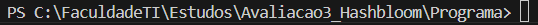
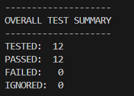

# Avaliacao3_Hashbloom
Repositório destinado ao desenvolvimento do trabalho acerca da 3º Avaliação de "Laboratório de Estrutura de Dados II"

## Integrantes
- Jozenias Antônio de Oliveira Filho
- Victor Manuel Fernandes Anacleto
- Pedro Henrique Queiroz
- Leandro Savio Barros Gomes

## Instruções de Compilação

O repositório inclui um Makefile para facilitar a compilação do programa principal e do gerador de lotes de usuários aleatórios utilizando o programa [Make](https://www.gnu.org/software/make/). É importante lembrar que o Makefile está configurado apenas para ambientes POSIX, caso você esteja em um Windows, irá precisar de uma shell que respeite esse formato para compilar.

### Compilação Normal

Para compilar e executar automaticamente o programa. Basta chamar o Make utilizando a regra padrão.

```bash
make
```

### Geração de Lotes

Para compilar o gerador e gerar um arquivo de lote, é necessário utilizar a regra `gerador` com um parâmeto `ARGS` que representa a quantidade de nomes no arquivo. Abaixo segue um exemplo de geração de 100 nomes aleatórios.

```bash
make gerador ARGS=100
```

### Compilação Debug

Para analisar o programa linha por linha, basta executar a regra `debug`.

```bash
make debug
```

### Compilação Manual

Caso você não queria usar o Make, mas ainda tenha acesso a um ambiente POSIX, você pode passar diretamente os parâmetros ao GCC.

```bash
gcc $(find ./programa/src/ -name "*.c") -o ./bin/hashbloom
```

Caso você esteja em um ambiente diferente, será necessário substituir a chamada do comando `find` pelo nome de todos os arquivos `.c` que estão dentro da pasta `./programa/src/`.

## Testes Unitários

### Como Rodar

#### 1º Passo: Instale a linguagem Ruby

Verifique no terminal se você já possui ela instalada com:

```terminal
ruby --version
```

Caso dê erro, significa que você ainda precisa baixar.

Nesse caso, acesse o site oficial da linguagem:

[Site Oficial](https://www.ruby-lang.org/pt/)

Após instalar, execute novamente o comando no terminal para confirmar que tudo está funcionando corretamente.

---


#### 2º Passo: Instalação do Ceedling


Para instalar, no terminal, digite o comando:

```terminal
gem install ceedling
```

#### 3º Passo: Rodar testes
Entre dentro da pasta raiz dos testes



Rode no terminal:
```
ceedling test:all
```

Resultado esperado:


### Formato de Entrada


### Exemplos de Execução
